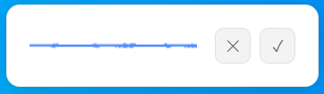

# 🎤 Speech-to-Text Clipboard Helper

A modern Electron application that lets you **record audio anywhere on your system** with a global shortcut and instantly get the transcription copied to your clipboard.



*Clean, modern interface with live waveform visualization and intuitive controls*

## ✨ Features

- **🌍 Global Shortcut**: Press `Ctrl+Shift+Space` anywhere to start/stop recording
- **🎨 Modern UI**: Clean, draggable overlay with live audio waveform visualization
- **🎯 Smart Transcription**: Uses Deepgram's Nova-2 model with smart formatting
- **📋 Auto-Copy**: Transcripts are automatically copied to your clipboard
- **🔕 Background Mode**: App runs silently in the background after transcription
- **🌐 Multilingual**: Supports Spanish transcription with automatic language detection
- **⚡ Fast & Lightweight**: No audio files saved to disk - everything in memory
- **🔧 Intuitive Controls**: Cancel (✕) or confirm (✓) recording with visual feedback

## 🚀 Quick Start

### Prerequisites
- **Node.js 22+** (required for Electron)
- **Deepgram API Key** (get one free at [console.deepgram.com](https://console.deepgram.com/))

### Installation

1. **Clone this repository**:
   ```bash
   git clone https://github.com/romanpcloudx/desktop-speech-to-text.git
   cd desktop-speech-to-text
   ```

2. **Install dependencies**:
   ```bash
   npm install
   ```

3. **Set up your API key**:
   Create a `.env` file in the project root:
   ```bash
   DEEPGRAM_API_KEY=your_deepgram_api_key_here
   ```

4. **Run the application**:
   ```bash
   npm start
   ```

## 🎮 How to Use

1. **Start the app** with `npm start`
2. **Press `Ctrl+Shift+Space`** anywhere on your system to open the recording overlay
3. **Speak clearly** - you'll see the live waveform visualization
4. **Finish recording** by:
   - Pressing `Ctrl+Shift+Space` again, OR
   - Clicking the **✓ (confirm)** button to transcribe, OR  
   - Clicking the **✕ (cancel)** button to discard
5. **Get your text** - transcription is automatically copied to clipboard
6. **Paste anywhere** with `Ctrl+V`

### Alternative Shortcuts
If `Ctrl+Shift+Space` conflicts with other apps, the following fallbacks are automatically tried:
- `Ctrl+Alt+Space`
- `Ctrl+Shift+R`

## 🎛️ Technical Details

### Architecture
- **Main Process** (`src/main.js`): Handles global shortcuts, window management, and permissions
- **Renderer Process** (`src/renderer.js`): Manages audio recording, waveform visualization, and API calls
- **Preload Script** (`src/preload.js`): Secure IPC bridge between main and renderer processes

### Audio Processing
- **Format**: WebM with Opus codec (fallback: OGG/WAV)
- **Quality**: 64kbps for optimal compatibility
- **Duration**: Minimum 1 second recording required
- **Real-time**: Live waveform visualization during recording

### Transcription
- **Service**: Deepgram API (Nova-2 model)
- **Language**: Automatic Spanish detection
- **Features**: Smart formatting, punctuation, numerals
- **Fallback**: Robust clipboard handling with multiple strategies

### UI/UX
- **Window**: 300×120px draggable overlay
- **Design**: Clean, modern interface inspired by ChatGPT
- **Animations**: Smooth transitions and visual feedback
- **Positioning**: Always on top, frameless, transparent background

## ⚙️ Customization

### Change Global Shortcut
Edit the `shortcuts` array in `src/main.js`:
```javascript
const shortcuts = ['Control+Shift+Space', 'YourCustomShortcut'];
```

### Modify Window Appearance
Edit the CSS in `index.html` to customize:
- Colors and themes
- Window size and position
- Animation timing
- Button styling

### Adjust Audio Settings
In `src/renderer.js`, modify:
```javascript
const options = { 
  mimeType,
  audioBitsPerSecond: 64000  // Change bitrate
};
```

### Configure Deepgram Parameters
Update the API parameters in `sendToDeepgram()`:
```javascript
const params = new URLSearchParams({
  model: 'nova-2',           // Change model
  language: 'es',            // Change language
  smart_format: 'true',      // Toggle formatting
});
```

## 🛠️ Development

### Project Structure
```
speech-to-text/
├── src/
│   ├── main.js          # Electron main process
│   ├── renderer.js      # Audio recording & transcription logic
│   └── preload.js       # Secure IPC bridge
├── img/
│   └── speech-to-text.PNG  # App screenshot
├── index.html           # UI and styles
├── package.json         # Dependencies and scripts
├── .env                 # API keys (create this)
└── README.md            # This file
```

### Debug Mode
The app includes comprehensive debug logging. Check the terminal where you ran `npm start` to see detailed logs of the recording and transcription process.

### Building for Production
For production deployment, you'll want to:
1. Package the app with `electron-builder` or similar
2. Code-sign the executable (required for macOS/Windows distribution)
3. Consider adding auto-updater functionality

## 🔧 Troubleshooting

### Common Issues

**Global shortcut not working?**
- Check if other apps are using the same shortcut
- Try the alternative shortcuts (Ctrl+Alt+Space, Ctrl+Shift+R)
- Restart the app to re-register shortcuts

**Microphone permission denied?**
- Grant microphone permissions when prompted
- On macOS: System Preferences → Privacy & Security → Microphone
- On Windows: Settings → Privacy → Microphone

**"No transcript returned" error?**
- Check your Deepgram API key in `.env`
- Ensure you have API credits available
- Try recording for at least 2-3 seconds
- Speak clearly and avoid background noise

**App won't close?**
- The app runs in background mode by design
- Use Task Manager (Windows) or Activity Monitor (macOS) to force quit
- Or press `Ctrl+C` in the terminal where you started it

## 🌟 Contributing

Contributions are welcome! Please feel free to submit issues, feature requests, or pull requests.

## 📄 License

MIT License - feel free to use this project for personal or commercial purposes.

---
